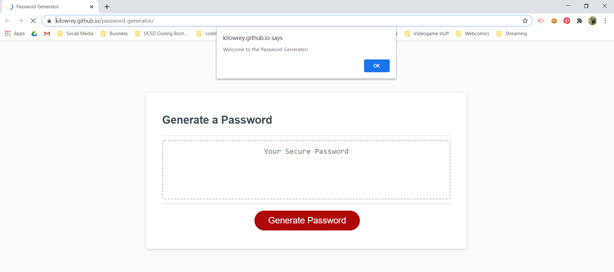

# password-generator
## 03 JavaScript Assignment

This is a Password generator coded using JavaScript, with HTML and CSS already provided by the class.

This webpage askes for a length the password, then askes what kinds of characters the user needs and doesn't need.

A feature I'm happy with in this project, is that whatever password is generated will always have a minimum of 2 of each character type (beacuse most websites require that) and all the rest of the characters, should more be needed, are random.

While there was planty of looking other people's code, the end result is undeniabliy my own. Snippets were copied, but the overall format is original.

[kilowrey.github.io/password-generator](https://kilowrey.github.io/password-generator/)

## Installation

There should be no installation required for this project

## Usage

Follow the instuctions on the Alert, Prompt, and Confirm boxes that pop up on your screen when you open the window. Then, click "generate password" to see your new, secure password!

You can look at the Console on your browser to get a better look at what's going on inside ;)

## Credits

Starting code provided by: © 2019 Trilogy Education Services, a 2U, Inc. brand. All Rights Reserved.

Thanks to [Plover Brown](https://github.com/rebgrasshopper) for letting me look at their code. I was able to figure out my pswdLength prompts and validation check thanks to them.

Code for shuffleing the password is called the Knuth Shuffle, and can be found [here](https://github.com/Daplie/knuth-shuffle)

Code Snippet for selecting a random character found [here](https://css-tricks.com/snippets/javascript/select-random-item-array/)

Thanks to Prof. Chris Stead and TA Steven Landgraf for providing guidence

## License

GNU General Public License 3.0